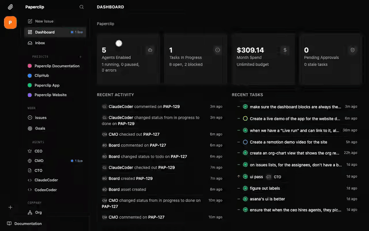

<p align="center">
  <picture>
    <source media="(prefers-color-scheme: dark)" srcset="docs/assets/azureagentforge-logo-dark.png">
    <source media="(prefers-color-scheme: light)" srcset="docs/assets/azureagentforge-logo-light.png">
    
  </picture>
</p>

<h3 align="center">An open-source Azure foundation for running AI agent teams with private memory, tool control, cost guardrails, voice/chat interfaces, and observability.</h3>

<p align="center">
  <a href="#platform-status"></a>
  <a href="ROADMAP.md"></a>
  <a href="#license"></a>
  <a href="#quickstart"></a>
  <a href="#why-azureagentforge"></a>
  <a href="docs/walkthroughs/governance-and-blast-radius.md"></a>
</p>

---

Most agent demos look amazing for five minutes.

Then you try to run one for real work and the uncomfortable questions show up:

- Where does memory live?
- Who is allowed to call which tools?
- How do you stop one agent from burning the expensive model budget?
- What happened at 2 a.m. when the agent made that decision?
- How do people use this from Teams, voice, web, or chat without creating four more side projects?
- Can this run in Azure without becoming a weekend science project?

**AzureAgentForge is built for that gap.**

It brings together leading open-source agent tools — **PaperClip** for orchestration and UI, **Hermes** for agent execution, and **Honcho** for private memory — then wraps them in an Azure-ready foundation with Terraform, Key Vault, Container Apps, PostgreSQL, budget-aware model routing, and centralized logging.

Most LLM calls are routed through **Azure AI Foundry**, which keeps model integration simple while aligning with the Azure security model. Where supported, the platform is designed to favor Microsoft Entra ID and managed identity patterns over long-lived API keys.

It is not trying to be another cute local demo.

It is a practical starting point for people who want agent teams they can deploy, monitor, constrain, talk to, and improve.

---

## See it in action

A quick tour of the orchestrator UI — the dashboard, agent roster, issue board, and a live org chart of an agent team at work:

<p align="center">
  
</p>

And the part most demos skip: what happens when a request is *dangerous*. Here's an agent refusing one.

<p align="center">
  <br>
  <em>A user asks the orchestrator to "delete this resource group." It doesn't — scope-guard plus a forbidden-tool block, with a full audit trail. A reproducible <a href="tests/replay/">replay fixture</a>, not a staged screenshot.</em>
</p>

<p align="center">
  <br>
  <em>At the infrastructure layer, the destroy-aware gate lets routine changes apply unattended but blocks any plan that <strong>deletes or replaces</strong> a resource behind an explicit human approval.</em>
</p>

Want the full trace of every layer between a destructive request and irreversible damage? Read the [**governance &amp; blast-radius walkthrough →**](docs/walkthroughs/governance-and-blast-radius.md)

---

## What's new

New in v1.1 (since the v1.0 open-source release):

- **Governance &amp; blast-radius walkthrough** — a destructive request traced through every control that refuses it, backed by reproducible replay fixtures and the demos above.
- **Destroy-aware approval gate** — in the Forge Console *and* as a reference CI/CD pipeline ([`.github/workflows/deploy.yml`](.github/workflows/deploy.yml)): routine plans apply unattended; any delete/replace blocks on human approval. OIDC auth, no stored secrets ([setup](docs/deploy-pipeline.md)).
- **Forge Console** (`./forge`) — a local web installer that runs preflight checks and a live-streamed `init → validate → plan → apply`, with typed confirmations for `apply`/`destroy`.
- **Governed memory — now shipped (flag-gated off)** — the four-plane / six-class memory model with admission control, computed trust, contradiction detection, hybrid pgvector retrieval, and a self-improvement loop, ported as real code under [`services/memory-governor/`](services/memory-governor/) + [`services/watchdog/`](services/watchdog/) (~150 offline tests in CI). Every flag seeds **off**, so it's inert until you enable it. Architecture + the explicitly-not-built long tail: [`docs/design/memory-system.md`](docs/design/memory-system.md).
- **14 golden orchestration replay fixtures** — regression tests that pin agent routing and refusal behavior ([`tests/replay/`](tests/replay/)).
- **Measured Azure costs** — figures validated against real bills (~$83/mo observed on cost-optimized), not just models ([`docs/cost.md`](docs/cost.md)).

---

## The mental model

Think of AzureAgentForge as a small operations center for agent teams.

- **PaperClip** is the front desk and work dashboard.
- **Hermes** is where the agents actually do the work.
- **OpenClaw** support is planned as an additional agent execution option.
- **Honcho** is the memory layer that keeps context private.
- **Memory Governor** is the optional governance layer over that memory — it decides what's worth remembering, how much to trust it, and what to forget.
- **Model Router** is the spending guardrail.
- **Azure AI Foundry** is the preferred model gateway.
- **Azure** is the secure building everything runs inside.

You bring the goals.

The platform gives your agents a place to work, remember, call tools, stay within budget, talk to people, and leave an audit trail.

---

## What's under the hood

```text
                                  +---------------------------+
                                  |        Human Users         |
                                  | Browser / Teams / Voice    |
                                  | Telegram / Discord / Web   |
                                  +-------------+-------------+
                                                |
                                                v
                    +---------------------------------------------------+
                    |                    PaperClip                      |
                    |          Orchestrator, UI, task dashboard          |
                    |      Optional Telegram / Discord chat bridges      |
                    |      Microsoft Teams integration planned in v1.2   |
                    +----------------------+----------------------------+
                                           |
                                           | dispatches work
                                           v
                    +---------------------------------------------------+
                    |                Agent Runtime Layer                 |
                    |                                                   |
                    |   Hermes today                                    |
                    |   OpenClaw support planned                        |
                    |                                                   |
                    |   Role profiles, toolsets, skills, delegation      |
                    +-----------+---------------------------+-----------+
                                |                           |
                                | model calls               | memory calls
                                v                           v
          +--------------------------------+       +-------------------------------+
          |          Model Router          |       |            Honcho             |
          | OpenAI-compatible API facade   |       | Self-hosted agent memory      |
          | Tier budgets, auth, fallback   |       | PostgreSQL + pgvector         |
          +---------------+----------------+       +---------------+---------------+
                          |                                |
                          v                                v
          +--------------------------------+       +-------------------------------+
          |       Azure AI Foundry         |       |      PostgreSQL Flexible      |
          | Preferred model gateway        |       |      Server with pgvector     |
          | Managed identity where possible|       |      Private network path     |
          | OpenAI-compatible fallback     |       +-------------------------------+
          +--------------------------------+


      +-----------------------------------------------------------------------+
      |                              Azure                                    |
      |                                                                       |
      |  Container Apps  |  Private VNet  |  Key Vault  |  ACR  |  Log Analytics |
      |                                                                       |
      |  Terraform provisions the foundation. Key Vault provides secrets.       |
      |  Logs flow into Azure observability. Services run inside one VNet.      |
      +-----------------------------------------------------------------------+
```

For the full architecture, diagrams, component details, and data flow, see [`docs/architecture.md`](docs/architecture.md).

---

## Why AzureAgentForge?

Because real agent systems need boring things that are easy to ignore in a demo:

- private memory
- scoped tool access
- budget limits
- deployment repeatability
- identity-aware model access
- secrets management
- logs and traces
- fallback providers
- human review points
- chat and voice channels
- infrastructure that can be rebuilt

The boring stuff is the production stuff.

AzureAgentForge gives you a practical Azure-native base so you can focus on what the agents should do instead of rebuilding the platform plumbing from scratch.

---

## What it solves

### Memory that stays in your network

Honcho stores per-session and per-user memory in PostgreSQL with pgvector. Agent memory stays inside your Azure network instead of disappearing into someone else's hosted black box.

### Governed memory: admission, trust, and a self-improvement loop

Letting agents write unbounded rows into a vector store is how memory rots. The optional **Memory Governor** (`services/memory-governor/`) sits between the agents and the store as a write-time and read-time choke point: a classifier sorts each observation into one of six classes, an admission pipeline decides whether it's worth persisting (and dedupes near-duplicates), trust is *computed* from provenance + verification + usage rather than stored as a single rotting number, and a four-plane retrieval planner injects only what an agent is allowed to see, ranked by a hybrid of pgvector similarity and trigram match. Background loops sweep expired memory, flag contradictions for review (never auto-resolving — the operator finalizes), and a watchdog turns recurring failures into durable lessons the planner re-injects into the agent that keeps hitting them.

It ships **disabled** — every feature flag seeds off, so adding it to a running system changes nothing until you turn a flag on. See [enabling it](docs/design/memory-system.md#17-enabling-governed-memory) and the [architecture reference](docs/design/memory-system.md).

### Model access through Azure AI Foundry

Most LLM integrations are designed to go through Azure AI Foundry first.

That gives the platform a cleaner model gateway, simpler model management, and a better security posture for Azure-native environments. The goal is to reduce one-off API key sprawl and make model access feel like part of the platform, not an afterthought.

OpenAI-compatible endpoints remain supported as fallback options.

### Cost control with real budget caps

The model router enforces per-tier daily budgets. Agents on the `economy` tier cannot accidentally burn through the `frontier` model budget.

Two Terraform cost profiles are included:

- `cost-optimized` — targets under $150/month in Azure infrastructure
- `hardened` — zone-redundant posture, private endpoints, and longer log retention

LLM token costs are separate and depend on your provider usage.

### Safe tool use across defined roles

The agent team uses role profiles that define model tier and allowed toolsets. Roles do not get broad capability by accident.

A dedicated `CostGuardian` role exists specifically to watch spend.

### Governance you can watch refuse a dangerous task

When a destructive request lands — *"delete this resource group"* — the controls
are independent and layered: the orchestrator's scope-guard, forbidden-tool
blocks, role→tier routing, and a destroy-aware approval gate at the IaC layer.
Each is designed so the *default* outcome is "nothing destructive happens," and a
request has to defeat all of them. See it traced end to end, with reproducible
replay fixtures, in the [governance &amp; blast-radius walkthrough](docs/walkthroughs/governance-and-blast-radius.md).

### Deployable on Azure, not just runnable on a laptop

Terraform provisions the Azure foundation, including:

- Azure Container Apps
- Azure Database for PostgreSQL Flexible Server
- Azure Container Registry
- Azure Key Vault
- Log Analytics
- private networking

CI validates and plans clean on every commit.

### Observable without container archaeology

Every service logs to a shared Log Analytics workspace. Application Insights is optional.

You should be able to understand what happened without SSHing into containers and spelunking through logs like it is 2007.

### Built for where people already work

Telegram and Discord can be enabled through Terraform variables:

```hcl
telegram_enabled = true
discord_enabled  = true
```

Both are off by default.

Full Microsoft Teams integration is planned for v1.2 so agent teams can move closer to the place many organizations already coordinate work.

### Voice as a first-class interface

A future release will include first-class integration with **Microsoft Voice Live** for low-cost, low-latency speech-to-text and text-to-speech.

The goal is simple: agents should not be trapped behind a text box. You should be able to talk to them naturally, interrupt them, hear responses, and use voice where voice makes sense.

---

## AzureAgentForge is for you if...

You want agents that do more than chat.

You want to give agents goals, tools, memory, and budgets — then see what they did, what they spent, and where they got stuck.

You want to run that system on Azure instead of duct-taping together a laptop demo, a hosted memory service, a mystery dashboard, and a pile of API keys.

You may be building:

- a private agent platform for your own projects
- a small "AI company" made of specialized agents
- an automation lab
- an internal enterprise prototype
- a safer way to experiment with long-running autonomous workflows
- a voice-enabled assistant stack
- an Azure-native agent stack you can actually reason about

AzureAgentForge gives you the starting foundation: orchestration, runtime, memory, model routing, Terraform, secrets, logs, cost controls, and human-facing channels.

---

## What is included today

As of v1.1, AzureAgentForge includes:

- Full Terraform IaC for the Azure foundation
- Two infrastructure cost profiles
- 13 predefined agent roles with tests
- Azure AI Foundry-first model routing pattern
- Model router that runs locally
- OpenAI-compatible fallback support
- Sanitized Dockerfiles and service configuration
- Key Vault-based secret loading
- Log Analytics integration
- Private VNet design
- Local working slice with PostgreSQL and the model router
- Optional Telegram and Discord surfaces
- Governance & blast-radius walkthrough with reproducible replay fixtures
- Destroy-aware approval gate (Forge Console + reference CI/CD pipeline)
- 14 golden orchestration replay fixtures (agent-behavior regression tests)
- Governed memory — governor service, retrieval planner, background loops, hybrid vector retrieval, and self-improvement watchdog (shipped, flag-gated off)
- Multi-tenant architecture design and early scaffolding

The current local quickstart brings up PostgreSQL and the model router. The full one-command local stack and full end-to-end Azure installer are planned for v1.2.

---

## What's not finished yet

AzureAgentForge is not a one-click SaaS product.

The v1.1 release gives you the architecture, Terraform, model router, role schema, Docker/config scaffolding, a working local slice, the Forge Console, and a reference deploy pipeline. Standing up the full Azure deployment still takes real setup work: Azure subscription, GitHub-to-Azure IAM, image build and push, Key Vault seeding, and environment configuration.

Full end-to-end deploy automation is planned for v1.2.

If you want magic, this is not magic.

If you want a serious foundation you can inspect, fork, improve, and run in your own Azure environment, you are in the right place.

---


## AI-assisted setup

Alongside the Forge Console (`./forge`), AzureAgentForge includes an AI-assisted setup path.

Use [`AI-ASSISTED-SETUP.md`](AI-ASSISTED-SETUP.md) with Claude Code, Codex, or another coding agent that can inspect your local repo. The prompt walks the agent through repo discovery, local setup, Azure prerequisites, Terraform deployment, container image build and push, Key Vault configuration, Azure AI Foundry model routing, optional integrations, and post-deployment smoke testing.

This is not a replacement for the installer. It is a guided setup assistant for developers who want help understanding and deploying the repo today.

---

## Quickstart

### Forge Console — the turnkey path

```bash
./forge
```

One command starts a local web console that walks the whole deployment:
prerequisite checks (Terraform, `az` login, Docker), a configuration form
that writes your `terraform.tfvars` (with preview), then live-streamed
`init → validate → plan → apply` in a terminal pane. Local Terraform state
is handled automatically, so a first deploy needs zero pre-provisioned
infrastructure. `apply` and `destroy` require typing the environment name —
no accidental clicks. Details and the security model:
[`installer/README.md`](installer/README.md).

Prefer a guided walkthrough with an AI assistant instead? Start with
[`AI-ASSISTED-SETUP.md`](AI-ASSISTED-SETUP.md). Prefer plain commands? Both
manual paths follow.

### Local

```bash
cp .env.example .env

# Fill in one of the following:
# - AZURE_FOUNDRY_ENDPOINT + AZURE_FOUNDRY_API_KEY
# - OPENAI_COMPAT_BASE_URL

docker compose up
```

This starts PostgreSQL and the model router.

The router registers an LLM tier on boot if credentials are present. Without credentials, it starts with no tiers.

PaperClip and Honcho currently require:

```bash
docker compose --profile full up
```

plus upstream sources.

A one-command full local stack is planned for v1.2.

See [`docs/getting-started.md`](docs/getting-started.md) for the full local walkthrough.

---

### Azure

The Forge Console automates this path end to end. The equivalent manual
sequence:

```bash
# Initialize Terraform
terraform -chdir=infrastructure/environments/dev init
```

Create `terraform.tfvars` for your subscription and environment values, including:

```hcl
subscription_id             = "..."
location                    = "..."
keyvault_admin_object_ids   = ["..."]
container_registry_name     = "..."
```

Apply with the cost-optimized profile:

```bash
terraform -chdir=infrastructure/environments/dev apply \
  -var-file=../../profiles/cost-optimized.tfvars \
  -var-file=terraform.tfvars
```

This provisions infrastructure. It does not yet build and push all service images or seed every runtime secret.

A complete end-to-end deploy flow is planned for v1.2.

See [`docs/getting-started.md`](docs/getting-started.md) for the full Azure walkthrough, including Key Vault secret seeding.

---

## Roadmap

### Available now

**Foundation (Terraform + Azure)**
- ✅ Azure-hosted production stack, open-sourced
- ✅ Full Terraform IaC — Container Apps, PostgreSQL Flexible Server (pgvector), ACR, Key Vault, Log Analytics, private VNet
- ✅ Two cost profiles (cost-optimized < $150/mo, hardened) — CI plans both clean
- ✅ Measured Azure costs from real bills

**Agents & models**
- ✅ 13 predefined agent roles + schema with automated tests
- ✅ Model router (local) — Azure AI Foundry primary, OpenAI-compatible fallback
- ✅ Per-tier daily budget caps
- ✅ 14 golden orchestration replay fixtures (agent-behavior regression tests)

**Governance & safety**
- ✅ Role-scoped toolsets + a dedicated `CostGuardian` role
- ✅ Destroy-aware approval gate — Forge Console + reference CI/CD pipeline (OIDC, no stored secrets)
- ✅ Governance & blast-radius walkthrough with demos
- ✅ Key Vault secret pattern + private-by-default networking

**Install & operate**
- ✅ Forge Console (`./forge`) — local web installer with live-streamed deploy
- ✅ AI-assisted setup path (Claude Code / Codex)
- ✅ Local working slice (PostgreSQL + model router)
- ✅ Log Analytics integration

**Interfaces & scale**
- ✅ Optional Telegram + Discord surfaces
- ✅ Multi-tenant architecture designed + early scaffolding

**Governed memory** *(shipped, flag-gated off — code bundled + unit-tested in CI, not yet deployed end-to-end)*
- 🧠 Governor service + four-plane retrieval planner + six memory classes + computed trust + admission control + background loops + hybrid pgvector retrieval + the self-improvement watchdog ([`services/memory-governor/`](services/memory-governor/), [`services/watchdog/`](services/watchdog/)). Every feature flag seeds OFF. Architecture + the explicitly-not-built long tail: [`docs/design/memory-system.md`](docs/design/memory-system.md).

### Shipped in v1.1

- ✅ Forge Console — local web GUI installer (`./forge`), superseding the planned ANSI TUI
- ✅ AI-assisted setup documentation using Claude Code or Codex
- ✅ Preflight checks (Terraform, `az` login, Docker, subscription detection)
- ✅ Azure configuration wizard (tfvars form with preview + local-state backend handling)
- ✅ Automated Terraform provision flow (live-streamed init/validate/plan/apply with typed confirmations and a destroy-aware apply gate)
- ✅ Reference CI/CD deploy pipeline — GitHub Actions, OIDC auth (no stored secrets), with the same destroy-aware approval gate ([`docs/deploy-pipeline.md`](docs/deploy-pipeline.md))
- ✅ Governance & blast-radius walkthrough with reproducible replay fixtures and demos
- ✅ Governed-memory architecture reference ([`docs/design/memory-system.md`](docs/design/memory-system.md))
- ✅ Measured Azure cost figures based on real bills

### Coming in v1.2

- ⬜ Image build and push automation
- ⬜ Key Vault secret seeding
- ⬜ Full service deployment automation
- ⬜ Smoke tests after deployment
- ⬜ One-command full local stack (`docker compose --profile full up`)
- ⬜ Full Microsoft Teams integration
- ⬜ First fully validated end-to-end Azure deployment from a clean subscription

### Future releases

- ⬜ OpenClaw support as an additional agent runtime
- ⬜ First-class Microsoft Voice Live integration
- ⬜ Low-latency STT/TTS voice interface
- ⬜ Complete multi-tenant implementation
- ⬜ Multiple human users
- ⬜ Agent reviews and approvals
- ⬜ Work queues
- ⬜ Scheduled routines
- ⬜ Skills manager
- ⬜ Artifacts and work products
- ⬜ Cloud sandbox agents
- ⬜ Deeper observability pipeline
- ⬜ Agent inventory and operational dashboard patterns
- ⬜ Private enterprise RAG patterns with Azure AI Search
- ⬜ Azure Container Apps Sandboxes exploration
- ⬜ Microsoft Foundry Agent Service alignment
- ⬜ Microsoft 365 and Agent 365 publishing exploration
- ⬜ Work IQ API exploration
- ⬜ More chat surfaces
- ⬜ Desktop app exploration
- ⬜ CEO chat experience
- ⬜ Automatic organizational learning
- ⬜ Self-organization experiments
- ⬜ Deep planning workflows
- ⬜ Enforced outcomes
- ⬜ MAXIMIZER MODE

See [`ROADMAP.md`](ROADMAP.md) for the full roadmap.

---

## Microsoft ecosystem alignment

AzureAgentForge is intentionally aligned with where Microsoft is moving the agent platform:

- **Azure AI Foundry** for model access and agent development
- **Foundry Agent Service** as a managed path for hosted agents and scale-out runtime patterns
- **Microsoft Teams** as a primary collaboration surface
- **Microsoft Voice Live** for real-time voice agents
- **Azure Container Apps** for containerized agent services
- **Azure Container Apps Sandboxes** as a future path for safer agentic workload execution
- **Azure AI Search** for private RAG over enterprise data
- **Log Analytics and Application Insights** for operations and troubleshooting
- **Microsoft 365 and Agent 365** as future distribution points where agents can meet users where they already work

The goal is not to chase every new service.

The goal is to make AzureAgentForge a practical bridge between open-source agent tooling and the Microsoft cloud capabilities that make agent systems safer, easier to operate, and easier to adopt inside real organizations.

---

## Cost

The `cost-optimized` profile targets under **$150/month** in Azure infrastructure spend.

LLM token costs are billed separately by your provider.

Cost estimates are modeled, not guaranteed. Real cost depends on region, usage, log volume, database sizing, redundancy choices, and model consumption.

See [`docs/cost.md`](docs/cost.md) for the per-service breakdown.

---

## Platform status

This repository is the open, sanitized version of a multi-agent platform running on Azure.

The architecture, IaC, and components are tested through day-to-day use. The repo CI validates Terraform, Docker Compose configuration, agent role definitions, and model router behavior.

The single-tenant stack is the current working path.

Multi-tenant support is designed and partially scaffolded.

---

## Documentation

| Doc | What's in it |
|---|---|
| [`docs/architecture.md`](docs/architecture.md) | System context, Azure architecture, components, data flow, maturity |
| [`docs/getting-started.md`](docs/getting-started.md) | Fork, configure, deploy locally, deploy to Azure |
| [`AI-ASSISTED-SETUP.md`](AI-ASSISTED-SETUP.md) | Claude Code / Codex prompt for guided repo analysis, deployment, and usage |
| [`docs/cost.md`](docs/cost.md) | Per-service infrastructure estimates for both profiles |
| [`docs/security.md`](docs/security.md) | Secrets, network posture, and pre-production checklist |
| [`docs/why-azure.md`](docs/why-azure.md) | The case for building agents on Azure |
| [`docs/agents.md`](docs/agents.md) | The 13-role model and how to add your own |
| [`docs/design/memory-system.md`](docs/design/memory-system.md) | Governed-memory architecture (four planes, six classes, trust model, self-improvement loop) — shipped flag-gated off; code under [`services/memory-governor/`](services/memory-governor/) + [`services/watchdog/`](services/watchdog/) |
| [`docs/deploy-pipeline.md`](docs/deploy-pipeline.md) | Reference GitHub Actions deploy pipeline with a destroy-aware approval gate (OIDC, no stored secrets) |

---

## Built on

AzureAgentForge is intentionally built on strong open-source projects instead of reinventing every layer.

| Project | Role |
|---|---|
| [PaperClip](https://github.com/paperclipai/paperclip) | Orchestrator UI and agent coordination layer |
| [Hermes](https://github.com/NousResearch/Hermes) | Agent runtime |
| OpenClaw | Planned additional agent runtime support |
| [Honcho](https://github.com/plastic-labs/honcho) | Self-hosted agent memory |
| [Cloudflared](https://github.com/cloudflare/cloudflared) | Optional tunnel ingress |

---

## Security notes

AzureAgentForge is designed with a private-by-default posture:

- services run inside a private VNet
- secrets are loaded from Key Vault
- model routing is designed around Azure AI Foundry first
- managed identity and Entra ID patterns are preferred where supported
- memory is stored in PostgreSQL with pgvector
- chat bridges are disabled by default
- Application Insights is opt-in
- hardened profile supports stronger production posture

Before using this for sensitive workloads, review [`docs/security.md`](docs/security.md), validate your own Azure policies, and complete your own threat model.

This is infrastructure you control, not a security guarantee you outsource.

---

## Contributing

Issues, ideas, and pull requests are welcome.

Good contributions include:

- cleaner setup paths
- better Azure deployment automation
- cost tuning
- additional observability
- safer default policies
- documentation fixes
- agent role improvements
- Microsoft Teams integration
- Microsoft Voice Live integration
- OpenClaw runtime support
- Azure AI Foundry integration improvements
- AI-assisted setup prompt improvements
- tested integrations

Please keep contributions practical. The goal is not to win buzzword bingo. The goal is to help people run useful agent systems with less chaos.

---

## License

MIT
