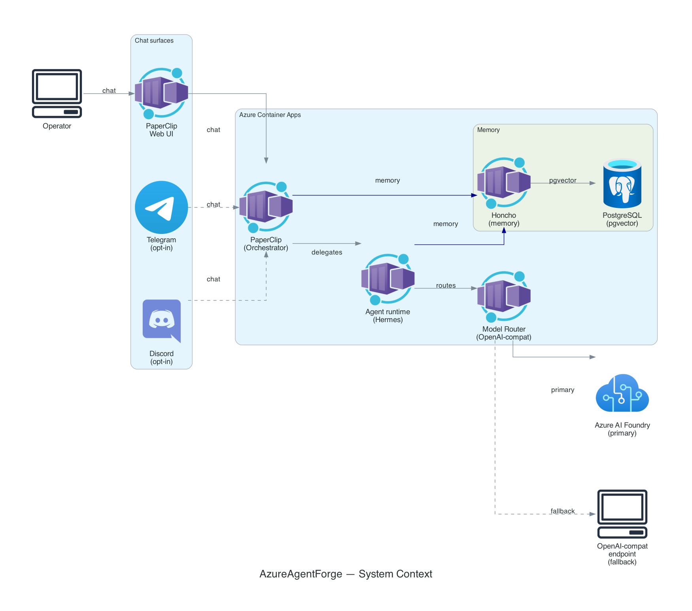
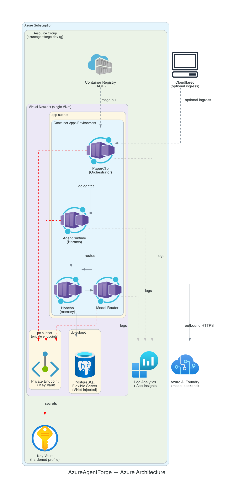
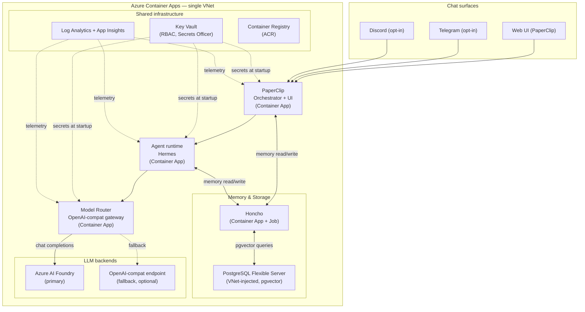

<p align="center">
  <picture>
    <source media="(prefers-color-scheme: dark)" srcset="assets/azureagentforge-logo-dark.png">
    
  </picture>
</p>

# Architecture

## Overview

AzureAgentForge runs on Azure Container Apps inside a single VNet. Four containerized services — PaperClip, Hermes, the Model Router, and Honcho — run alongside a private PostgreSQL Flexible Server. Traffic between them stays inside the VNet; LLM inference leaves only through the Model Router, bound for Azure AI Foundry or a fallback OpenAI-compatible endpoint. Users reach the platform through PaperClip's web UI, or optionally through Telegram and Discord bridges. Credentials live in Key Vault and are fetched at container startup. Logs go to a shared Log Analytics workspace.

---

## Components

<p align="center"></p>

<p align="center"></p>



### PaperClip

**Role:** orchestrator and web UI.  
**Azure resource:** `azurerm_container_app` (`paperclip`).

PaperClip is the entry point for all chat surfaces. It accepts requests from the web UI and, when enabled, from the Telegram and Discord bridges. It dispatches work to Hermes, reads and writes agent memory through Honcho, and returns results to the user.

### Agent runtime (Hermes)

**Role:** executes agent tasks using the 13-role hierarchy.  
**Azure resource:** `azurerm_container_app` (`hermes`).

Hermes runs the agents defined under `agents/`. Each agent carries a YAML profile that assigns it a `model_tier` (`frontier`, `standard`, or `economy`) and a set of capability `toolsets`. The Model Router resolves those tiers to concrete model deployments at call time. Hermes reads and writes conversational memory through Honcho.

See [`../agents/README.md`](../agents/README.md) for the full role hierarchy and profile schema.

### Model Router

**Role:** OpenAI-compatible gateway with per-tier budgets, fallback chains, and bearer auth.  
**Azure resource:** `azurerm_container_app` (`model-router`).

The router exposes a single `/v1/chat/completions` endpoint. When a request arrives, it selects a tier from `PERSONA_TIERS_JSON` (which maps agent role slugs to tier names), then routes to the matching Foundry deployment. If the primary tier is over budget or unavailable, it falls back through a built-in chain:

- `gpt4o-mini` falls back to `phi4`
- Foundry optional tiers (CLAUDE, KIMI, GROK) fall back to `gpt4o-mini`
- Ollama local tiers fall back to `gpt4o-mini` (or `OLLAMA_FALLBACK_TIER`)

`phi4` is required at startup; `gpt4o-mini` is the required primary. Additional Foundry tiers are registered only when all three of their env vars (`<PREFIX>_BASE_URL`, `<PREFIX>_API_KEY`, `<PREFIX>_MODEL`) are present. The Claude tier uses a direct Anthropic SDK call to work around LiteLLM's handling of Foundry's `/anthropic` endpoint.

Per-tier daily budget caps and max token overrides are set via `<PREFIX>_DAILY_BUDGET_USD` and `<PREFIX>_MAX_TOKENS`.

### Honcho

**Role:** self-hosted agent memory with fact extraction.  
**Azure resources:** `azurerm_container_app` (`honcho`) + `azurerm_container_app_job` (`honcho-deriver`).

Honcho stores per-session and per-user memories for agents. It sits in front of PostgreSQL and uses pgvector for semantic recall. The Deriver component runs as a scheduled Container Apps Job (hourly, up to 10 minutes) rather than an always-on app, saving roughly $0.55/day at the cost of up to one hour of recall lag for new sessions.

Both Honcho and PostgreSQL are private; no agent memory leaves the VNet.

> **Beyond basic memory.** The shipped stack uses Honcho's native session/user
> memory directly. A fuller **governed-memory** model — admission control,
> six memory classes, a four-plane retrieval planner, computed trust, contradiction
> detection, and a self-improvement loop — is documented as a design reference in
> [`design/memory-system.md`](design/memory-system.md). That governor service is
> *not* bundled in this repository; the doc is the architecture to build toward.

### PostgreSQL Flexible Server

**Role:** primary data store for agent memory (Honcho), tenant registry, sync state, and audit logs.  
**Azure resource:** `azurerm_postgresql_flexible_server` (PostgreSQL 15, VNet-injected).

The server runs with `public_network_access_enabled = false`, a delegated subnet, and a private DNS zone (`privatelink.postgres.database.azure.com`). HA is configurable: the `cost-optimized` profile leaves it off; `hardened` enables zone-redundant standby. The `pgvector` extension supports Honcho's semantic memory queries.

### Key Vault

**Role:** secret store for credentials and API keys.  
**Azure resource:** `azurerm_key_vault` (RBAC model, Secrets Officer grants).

Secrets are created out-of-band (manually or via pipeline) and referenced by container apps at startup. Admins get the `Key Vault Secrets Officer` role; no inline access policies are used. In the `hardened` profile, public network access is disabled and a private endpoint is required.

### Log Analytics + Application Insights

**Role:** telemetry aggregation and distributed tracing.  
**Azure resources:** `azurerm_log_analytics_workspace` + `azurerm_application_insights`.

All container apps send traces and logs here. Retention is 30 days in `cost-optimized` (with a 1 GB/day ingestion cap) and 90 days in `hardened` (unlimited ingestion).

### Ingress

**Role:** terminates inbound HTTPS traffic.  
**Azure resources:** Azure Container Apps managed ingress (default) or `azurerm_container_app` (Cloudflared, optional).

The `cost-optimized` profile uses ACA's built-in managed ingress with IP-restriction rules on the Container Apps environment. The `hardened` profile replaces this with a Cloudflared tunnel container (`cloudflared_enabled = true`), which eliminates public inbound ports entirely and routes traffic through Cloudflare's edge.

---

## Data flow

Happy path for a user-initiated request:

1. **User → PaperClip.** A message arrives at PaperClip from the web UI, Telegram, or Discord.
2. **PaperClip → Honcho (memory read).** PaperClip fetches relevant memories for the session from Honcho before dispatching work.
3. **PaperClip → Hermes.** PaperClip dispatches a task to the appropriate agent in Hermes.
4. **Hermes → Honcho (memory read/write).** The agent reads prior context and writes new facts back as the task runs.
5. **Hermes → Model Router.** The agent sends a chat completion request to the router, including its persona/role identifier.
6. **Model Router → Azure AI Foundry.** The router selects the tier for that persona, checks the daily budget, and proxies the request to the Foundry deployment. If Foundry is unavailable or over budget, it falls back down the chain.
7. **Model Router → Hermes.** The router returns the completion to the agent.
8. **Hermes → PaperClip.** The agent returns its output to PaperClip.
9. **PaperClip → user.** PaperClip sends the response back to the originating surface.
10. **Secrets (at startup).** Each container app reads its credentials from Key Vault when it starts; secrets are not fetched per-request.

---

## Agent model

AzureAgentForge ships with 13 defined roles organized in a reporting tree. `Orchestrator` is the root; all other roles report up through it. Each role has a `model_tier` (`frontier`, `standard`, or `economy`) and a list of capability `toolsets`. The Model Router resolves tiers to concrete model deployments at runtime, so the agent profiles are decoupled from specific model names.

For the full role hierarchy, profile schema, and instructions for adding roles, see [`../agents/README.md`](../agents/README.md).

---

## Configuration and profiles

### Feature flags

Two chat surfaces are off by default and enabled with a single Terraform variable each:

| Variable | Default | Surface |
|---|---|---|
| `telegram_enabled` | `false` | Telegram bridge container app |
| `discord_enabled` | `false` | Discord bridge container app |

`cloudflared_enabled` follows the same pattern for ingress mode.

### Cost profiles

Two `.tfvars` files under `infrastructure/profiles/` control the cost and security posture:

| Profile | Target infra cost | HA | Log retention | Ingress | Key Vault access |
|---|---|---|---|---|---|
| `cost-optimized` | < $150/mo | Off | 30 days (1 GB/day cap) | ACA managed | Public + firewall |
| `hardened` | ~$250+/mo | Zone-redundant | 90 days (unlimited) | Cloudflared tunnel | Private endpoint |

PostgreSQL is VNet-injected in both profiles. LLM token spend is billed separately and excluded from the figures above.

Apply a profile by passing it as the first `-var-file`, with environment-specific overrides second:

```bash
terraform apply \
  -var-file=../../profiles/cost-optimized.tfvars \
  -var-file=terraform.tfvars
```

See [`../infrastructure/profiles/README.md`](../infrastructure/profiles/README.md) for the full variable table.

---

## Maturity

This stack runs in production on Azure — the architecture and components below are
battle-tested in day-to-day use. This repository is the sanitized, reusable version
of that platform; its CI validates every commit to plan stage (Terraform
validate/plan, `docker compose config`, unit/schema tests), since a fork's own
subscription and credentials are not bundled here.

| Component | Status | Notes |
|---|---|---|
| Terraform modules (network, postgres, keyvault, container-apps, monitoring, registry) | proven | Runs in production; repo CI validates + plans clean |
| Model Router (routing logic, fallback chain, budget caps) | proven | Runs in production; unit tests pass |
| Agent profiles (13 roles, profile schema) | proven | In daily use; schema validation passes |
| `docker-compose.yml` (local dev stack) | proven | Local working slice (postgres + model-router); full stack via `--profile full` |
| Cost profiles (`cost-optimized`, `hardened`) | proven | In use; repo CI plans clean for both |
| Multi-tenancy (schema-per-tenant, RLS, per-tenant routing) | design target | ~20-30% implemented; not yet deployed; see [`../roadmap/multi-tenant/`](../roadmap/multi-tenant/) |
| Governed memory (planes/classes/trust/self-improvement loop) | shipped (flag-gated off) | Governor + retrieval planner + background loops + hybrid vector retrieval + self-improvement watchdog ported under [`../services/memory-governor/`](../services/memory-governor/) and [`../services/watchdog/`](../services/watchdog/); ~150 offline tests in CI; every flag seeds OFF (ship-dark). Long-tail items (reflection pass, inspector UI, in-channel controls, contradiction auto-resolve) remain design-only — see [`design/memory-system.md`](design/memory-system.md) §15 |
| Reference deploy pipeline (destroy-aware approval gate) | reference | [`deploy-pipeline.md`](deploy-pipeline.md) + `.github/workflows/deploy.yml`; adopters wire to their own subscription |

**Status vocabulary:**
- `proven` — deployed and running in the maintainer's production Azure environment. This repository is the sanitized version; standing up your own instance takes manual setup (subscription, IAM/auth, building and deploying the OSS components, secret seeding), automated by the v1.1 CLI installer.
- `design target` — design is substantially complete; implementation is partial or a scaffold; not yet deployed.
- `design reference` — a complete, implementable architecture is documented here, but the implementing code is intentionally not bundled in this repository.
- `shipped (flag-gated off)` — the implementing code is bundled, sanitized, and unit-tested in CI, but ships disabled (every feature flag seeds OFF) and has not been deployed or verified end-to-end against a live database. An honest middle ground between `design reference` and `proven`.
- `reference` — a ready-to-adapt template (e.g. a workflow) that adopters wire to their own subscription; not run by this repo's CI.

For the multi-tenancy roadmap, see [`../roadmap/multi-tenant/README.md`](../roadmap/multi-tenant/README.md).
