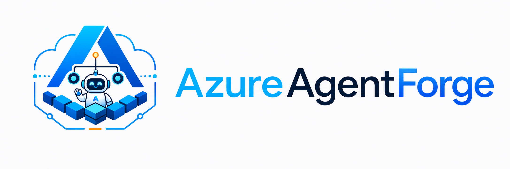

<p align="center">
  <picture>
    <source media="(prefers-color-scheme: dark)" srcset="assets/azureagentforge-logo-dark.png">
    
  </picture>
</p>

# Local development

`docker compose up` starts two services: Postgres and the model-router. That is
the v1.0 working slice, enough to develop and test LLM routing without the
rest of the stack. PaperClip and Honcho need `docker compose --profile full up`
plus upstream project sources; that becomes one-command in v1.1. You need Docker
Desktop and an LLM endpoint: Azure AI Foundry or anything OpenAI-compatible.

---

## Environment setup

Copy the example file and fill in your LLM credentials:

```bash
cp .env.example .env
```

The minimum you need to fill in before `docker compose up` will succeed:

- **`LLM_PROVIDER`**: keep `azure_foundry` if you have an AI Foundry
  project, or change to `openai_compat` for any other endpoint.
- **`AZURE_FOUNDRY_ENDPOINT` + `AZURE_FOUNDRY_API_KEY`**: if using AI
  Foundry.
- **`OPENAI_COMPAT_BASE_URL` + `OPENAI_COMPAT_API_KEY`**: if using an
  alternative endpoint.

Everything else has a working default. Postgres uses `aaf`/`localdev`/`aaf`
unless you override `POSTGRES_USER`, `POSTGRES_PASSWORD`, and `POSTGRES_DB`.
Leave the bot tokens empty unless you are testing Telegram or Discord.

---

## Starting the stack

```bash
docker compose up
```

First run builds the model-router image from `services/model-router` and pulls
the Postgres image. Expect a minute or two. Subsequent starts are fast.

### What comes up (default slice)

| Service | Port | What it does |
|---|---|---|
| `postgres` | 5432 | PostgreSQL 16 with pgvector extension |
| `model-router` | 8080 | Routes LLM requests; normalises Foundry and OpenAI-compat APIs |

Postgres data persists in the `pgdata` named volume between restarts.

---

## Iterating on a service

To rebuild a single service after editing its code:

```bash
docker compose up --build paperclip
```

Replace `paperclip` with whichever service you changed. The other services
keep running.

To tear everything down and start clean (this drops the `pgdata` volume):

```bash
docker compose down -v
docker compose up
```

---

## Limitations

Each service has its own `Dockerfile` under `services/<name>/Dockerfile`.
They build from upstream base images. If an upstream image changes its
interface, the build may break. Check `services/<name>/Dockerfile` for the
exact base and pin if you need reproducibility.

PaperClip and Honcho are behind the `full` Compose profile
(`docker compose --profile full up`). Their Dockerfiles reference upstream
projects (paperclipai/paperclip, plastic-labs/honcho) not vendored in this
repo; you need to clone those sources before building. The one-command full
local stack is v1.1.

The `agent-runtime` service has a Dockerfile in `services/agent-runtime/`
but no entry in `docker-compose.yml`. It is not part of the local stack.

There is no hot-reload. After changing source files in a service, you need
to rebuild that container (`docker compose up --build <service>`).
