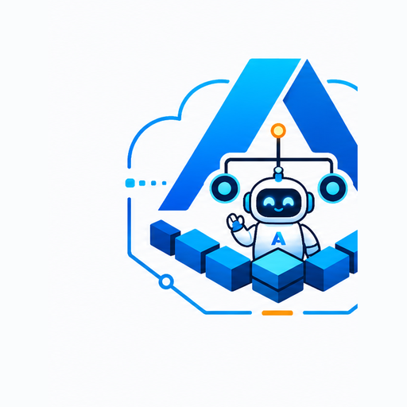

  <picture>
    <source media="(prefers-color-scheme: dark)" srcset="assets/azureagentforge-icon-dark.png">
    
  </picture>

# Why Azure

Choice of cloud is one of those decisions that feels administrative until you are deep enough in to understand what it actually determined.

## Azure AI Foundry and why it matters here

Azure AI Foundry gives you GPT-4o and Phi-4 under your own Azure subscription, billed through your account, with enterprise data-handling commitments that matter to regulated buyers. Calling the OpenAI API directly means sharing infrastructure, and your data may be used for model improvement by default. For enterprise teams with data-residency requirements, that default is a dealbreaker.

The multi-agent economics push harder toward Foundry. AzureAgentForge assigns each agent role a tier: `frontier` for the Orchestrator and Coder, `standard` for QA and Strategy, `economy` for Researcher and Psychology. The router maps those tiers to concrete Foundry deployments at call time. If you decide phi4 is good enough for your economy tier, you change one environment variable, not thirteen agent definitions. Agent profiles know roles, not model names.

Foundry is not the cheapest way to get these models. Token costs run higher than calling OpenAI directly. It earns that premium when you need model access under your Azure spend commitment or when data-residency requirements rule out the alternative. For pure cost minimization with no enterprise constraints, it is probably the wrong call.

## Container Apps and the scale-to-zero tradeoff

Four services run as Azure Container Apps: PaperClip, Hermes, the Model Router, and Honcho. Container Apps bills on vCPU-seconds and memory-seconds consumed. A container not handling requests scales to zero and costs nothing. For an agent platform where most workers sit idle most of the time, that billing shape fits.

The cost-optimized profile targets under $150/month in Azure infrastructure spend. Most of that is two always-on replicas (PaperClip and the Model Router, both of which need to be responsive) plus a PostgreSQL Flexible Server at the B1ms burstable tier. Hermes and the Honcho Deriver job can scale to zero when idle.

Cold starts are the price of that savings. When a Container App scales from zero, there is a startup lag while the image pulls and the process initializes. For an interactive agent platform, that lag is a real problem. Hermes keeps its image small to reduce pull time, but eliminating the penalty entirely requires pinning a minimum replica, which takes back some of what scale-to-zero gave you. The right balance depends on your latency tolerance and traffic pattern.

## VNet, private networking, and the hardened profile

Every service runs inside a single Azure VNet. PostgreSQL is VNet-injected with `public_network_access_enabled = false`. No public endpoint exists. Honcho and its database never reach the public internet. Agent memory stays inside the VNet.

Key Vault uses the RBAC model. Containers fetch their secrets at startup; credentials are never stored in environment variables or container definitions. In the `hardened` profile, Key Vault's public network access is disabled and requires a private endpoint. Someone who compromises the container image cannot reach the secret store without being inside the VNet.

The two profiles, `cost-optimized` and `hardened`, are `.tfvars` files that flip a coordinated set of variables: HA mode on PostgreSQL, log retention duration, whether Cloudflared replaces the ACA managed ingress, Key Vault endpoint visibility. The `hardened` profile costs roughly $250+/month versus $70-115 for cost-optimized. That gap comes mostly from the PostgreSQL zone-redundant standby, 90-day log retention, and the Cloudflared sidecar that runs permanently.

Setting up the private endpoint correctly requires a private DNS zone (`privatelink.vaultcore.azure.net`), a VNet link, and a DNS A record. Azure handles all of that through the portal click-through. In Terraform you spell it out yourself. Get it wrong and your containers start and immediately fail to resolve `<vault-name>.vault.azure.net`. The error looks like an auth problem. It is a DNS problem.

## Where the cost surprises are

Log Analytics is easy to underestimate and the most common place to be surprised. The cost-optimized profile caps daily ingestion at 1 GB and retention at 30 days. Both caps are active choices; the defaults are higher. Remove either and a verbose service can generate 3-5 GB/day in development. Log Analytics bills per GB ingested. The estimate in `docs/cost.md` is $5-15/month with the cap in place. Without it, that number climbs fast and the bill arrives before you notice.

Pinning `min_replicas = 1` on Hermes to avoid cold starts costs roughly $10-15/month per replica at 0.25 vCPU / 0.5 GB. Not catastrophic, but it is not the zero you were expecting from "scale to zero."

LLM token spend does not appear in the infrastructure cost numbers at all. The cost profiles track Azure resource costs. GPT-4o token spend at any real usage level dwarfs everything above it, and it is billed separately through your Foundry deployments. Budget for it on its own line.

## Model availability by region

Azure AI Foundry's model catalog varies by region. GPT-4o deployments are available in most; Phi-4 has a shorter list. The router's fallback chain (`gpt4o-mini` to `phi4`) assumes both are available in your selected region. If one is not, the service fails at startup with a missing-deployment error: the router validates its required tiers on boot. Check model availability before picking a region, not after.

## Who should use this

Nothing here has been deployed end-to-end against live Azure infrastructure. Terraform validates and plans clean; the tests pass; the compose stack starts. A smoke-tested live environment does not exist yet.

What the repo is is a complete infrastructure-as-code design for an agentic platform: VNet-private memory, a model router you can swap backends through without touching agent code, cost profiles that let you dial between development economics and production security posture, and a 13-role agent hierarchy where the model assignments are a runtime configuration rather than baked in. The interesting parts are how the pieces connect, in code you can run `terraform plan` against rather than a diagram.

The engineers this is useful to are building multi-agent systems on Azure and want infrastructure that takes private networking, key management, cost observability, and model abstraction seriously from the start, rather than bolting them on later. It runs in production today; this repo is the open, reusable version of that platform, not a packaged product.
